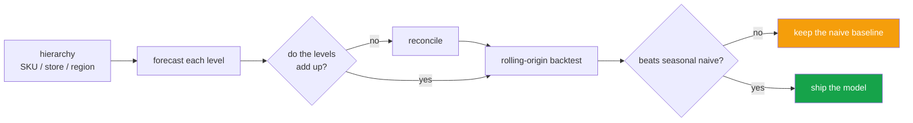

<h1 align="center">demand-forecast-platform (Python · hierarchical reconciliation · Croston · ETS)</h1>
<p align="center"><i>Hierarchical forecasting where the numbers add up, and a backtest that cannot lie to you</i></p>

<p align="center">
  <a href="#the-problem-nobody-mentions-in-the-tutorial">The problem</a> &middot;
  <a href="#intermittent-demand">Intermittent demand</a> &middot;
  <a href="#the-backtest-cannot-leak">The backtest</a> &middot;
  <a href="#mape-is-the-wrong-metric-and-it-is-the-industry-default">MAPE</a> &middot;
  <a href="#does-anything-beat-seasonal-naive">Does anything beat naive?</a> &middot;
  <a href="#problems-hit-while-building-this">Problems hit</a>
</p>

<p align="center">
  <a href="https://github.com/hammasbuilds/demand-forecast-platform/actions/workflows/ci.yml"></a>
  
  
  <a href="LICENSE"></a>
</p>

---

## The problem nobody mentions in the tutorial



**The seasonal-naive check is the honest part.** A forecast that does not beat it is not a
forecast, it is an expense - and most tutorials never run the comparison.


```
total  = 1000      ← forecast independently
  north =  400     ← forecast independently
  south =  550     ← forecast independently
```

`400 + 550 = 950 ≠ 1000`. The regional plans and the national plan disagree by 50
units, and procurement, staffing and cash are now planned against two numbers that
cannot both be right.

Forecasting each level separately **always** does this — every level is fitted to its
own noise. Reconciliation makes them agree.

And coherence is *exact arithmetic*, which makes it one of the very few
machine-learning properties you can **assert** instead of measure:

```python
@pytest.mark.parametrize("method", ["bottom_up", "optimal"])
def test_every_method_produces_coherence(method):
    assert h.is_coherent(result)
```

| Method | Correct when |
|---|---|
| **bottom-up** | Leaves carry enough signal. Coherent by construction — and it throws away every forecast made above leaf level. |
| **top-down** | The total is stable and the leaves are sparse. Cannot represent a leaf whose share is changing. |
| **optimal** | Both levels carry real information. Keeps every forecast and distributes the disagreement. |

`optimal` runs bottom-up to blend, then top-down to distribute. **The order is the
whole trick** — a single top-down pass overwrites the value each node's parent just
fixed, so every level silently breaks the one above it. That was a real bug here,
caught by running the coherence check.

Setting every weight to zero makes `optimal` degenerate exactly to bottom-up — also a
test, because a knob that does not do what it claims is worse than no knob.

## Intermittent demand

Spare parts and wholesale produce series that are 80% zeros with occasional orders.
Ordinary smoothing lets the zeros drag the level toward zero between orders, so the
forecast is always too low just before an order and too high just after.

**Croston's method** smooths two series instead — the *size* of a non-zero demand and
the *interval* between them — and forecasts size ÷ interval. That removes the
oscillation, and it is why averaging gives you "0.3 units" for something only ever
ordered in whole boxes.

## The backtest cannot leak

A backtest that lets the model see data after the forecast origin reports an accuracy
the system will never achieve, and reports it *confidently*. So the property is
asserted directly, by watching what the forecaster was handed:

```python
def test_the_forecaster_never_sees_the_future():
    for window in seen:
        assert window == series[: len(window)]
        assert max(window) < series[len(window)]
```

A forecaster that mutates its input also cannot corrupt later folds — it gets a copy.
That too is a test.

## MAPE is the wrong metric, and it is the industry default

MAPE divides by the actual value, so a zero makes it infinite and a near-zero makes it
enormous. Intermittent demand is *full* of zeros — MAPE reports nonsense exactly where
forecasting is hardest.

**MASE** divides the model's error by what seasonal naive would have scored on the
training data:

```
MASE < 1    better than doing nothing
MASE = 1    no better than doing nothing
MASE > 1    worse than doing nothing
```

Scale-free, comparable across series, and it answers the question the project exists
to answer. The denominator is computed **in-sample** — using the test period would let
the difficulty of the test set flatter the model.

On a perfectly flat series, MASE returns `NaN` rather than `0.0`: there is no naive
error to compare against, and reporting zero would claim perfection.

## Does anything beat seasonal naive?

The question that decides whether a forecasting project is worth doing. In retail the
answer is frequently *no*, and a team that never checked cannot tell whether its model
adds value or launders the seasonality it was handed.

```python
compare(series, {"naive": naive, "seasonal": seasonal, "croston": croston})
# {"seasonal": {"mase": 1.0, ...}, "naive": {"mase": 31.7, "beats_benchmark": False}}
```

Seasonal naive scores exactly 1.0 — it *is* the denominator, so it cannot beat itself.
That is the line any model has to come in under.

## Usage

```python
h = Hierarchy()
h.add("total")
h.add("north", parent="total")
h.add("south", parent="total")
h.add("lahore", parent="north")
h.add("karachi", parent="south")

# history: one series per node, oldest first - build your own with forecast.io.read_csv,
# or see "Run it yourself" below for a fully worked, runnable example
base = {name: naive(history[name], horizon=4) for name in h.nodes}
plan = optimal(h, base)  # coherent everywhere

assert h.is_coherent(plan)

rolling_origin(history["lahore"], croston, horizon=4, period=52).summary()
```

## Tests

**77 tests. No dependencies, no fixtures, no data download.**

| Covered | |
|---|---|
| Hierarchy | structure, levels, duplicate/second-root/unknown-parent rejection, incoherence of independent forecasts |
| Reconciliation | coherence for every method (including `mint_ols`/`mint_wls`), leaf and root preservation, weight-0 degeneracy, proportional absorption, deep trees, empty history |
| Models | naive, seasonal, moving average, drift, Croston on intermittent/single/all-zero demand, ETS family (`ses`/`holt`/`holt_winters`/`ets`) |
| Metrics | sMAPE bounds and the 0-vs-0 case, MASE direction, in-sample denominator, flat-series `NaN` |
| Backtest | **leakage**, expanding window, wrong-length output, mutating forecaster, short series raise instead of silently returning nothing, identical folds, `beats_benchmark` against a real out-of-sample benchmark |
| Validation | NaN/negative-safe reconciliation, `step`/`horizon`/`alpha` rejected out of range instead of looping or producing garbage |
| CSV / CLI | column errors named, missing cells filled or refused, `forecast`/`backtest`/`evaluate` end to end |

## Limits

- `mint` solves the least-squares reconciliation with a diagonal covariance (OLS or
  structural-scaling weights), from scratch with its own Cholesky solver - no numpy.
  `optimal`/`weighted_blend` is the cheaper heuristic instead, for when an m-by-m
  solve (m = leaves) is more machinery than the disagreement is worth. Like every
  MinT variant, it can return negative values for a non-negative series when the
  base forecasts disagree badly enough.
- Baselines only. Gradient boosting and state-space models fit behind the same
  `Forecaster` signature — but the baselines are what they must be scored against,
  which is why they are here first.
- One seasonal period. Daily-and-weekly together needs decomposition.
- No exogenous regressors. Promotions and holidays are the obvious next feature and the
  backtest harness already accommodates them.

## Keywords

demand forecasting &middot; hierarchical forecasting &middot; forecast reconciliation &middot; intermittent demand &middot; Croston &middot; ETS &middot; exponential smoothing &middot; rolling origin backtest &middot; walk-forward validation &middot; MAPE &middot; sMAPE &middot; MASE &middot; seasonal naive baseline &middot; time series &middot; supply chain &middot; inventory &middot; retail analytics

## License

MIT

---

## Run it yourself

```bash
git clone https://github.com/hammasbuilds/demand-forecast-platform
cd demand-forecast-platform

pip install -e ".[dev]"  # zero runtime dependencies; pytest for development
pytest -q                # 77 tests, under a second
```

Every call below is real and runs as shown:

```python
import random
from forecast import Hierarchy, compare, croston, naive, naive_seasonal, optimal

h = Hierarchy()
h.add("total")
h.add("north", parent="total")
h.add("south", parent="total")
h.add("lahore", parent="north")
h.add("karachi", parent="south")

rng = random.Random(3)
history = {
    "lahore": [50 + 10 * rng.random() + (i % 52) for i in range(120)],
    "karachi": [40 + 8 * rng.random() + (i % 52) for i in range(120)],
}
history["north"] = history["lahore"]
history["south"] = history["karachi"]
history["total"] = [a + b for a, b in zip(history["lahore"], history["karachi"])]

base = {name: naive(history[name], horizon=4) for name in h.nodes}
plan = optimal(h, base)
assert h.is_coherent(plan)  # children sum to parents, exactly

compare(
    history["lahore"],
    {
        "naive": naive,
        "seasonal": lambda hist, n: naive_seasonal(hist, n, period=52),
        "croston": croston,
    },
    horizon=4,
    period=52,
)
```

### On your own data

```bash
demand-forecast forecast sales.csv --time week --value sales \
    --levels region,store --horizon 4 --period 52
demand-forecast backtest sales.csv --time week --value sales --levels region --json
```

A long-format CSV in, one row per `(levels..., period)`; a missing `(store, week)` cell
is filled with 0 by default (`--missing error` to refuse instead). `forecast` defaults
to `ets` reconciled with `mint_wls`; `--model` and `--method` list every option in
`--help`.

### Input / Output

`python demo.py`, verbatim (shown as text, not a screenshot, so it never goes stale
without the tests noticing):

```
INPUT
   examples/weekly_sales.csv: 760 rows, 156 weeks (2023-01-02 .. 2025-12-22)
   8 nodes: total, north, north/islamabad, north/lahore, north/multan, south, south/hyderabad, south/karachi
   20 store-weeks with no row (north/multan opened late) filled with 0

OUTPUT
1. ETS forecast of every node, 4 weeks ahead
   coherent as forecast?  False
      week +1: north + south =   577.8, total says   604.0  (off by -26.2)
      week +2: north + south =   577.8, total says   613.1  (off by -35.4)
      week +3: north + south =   580.8, total says   615.5  (off by -34.7)
      week +4: north + south =   592.9, total says   608.2  (off by -15.3)

   method          coherent  total, weeks +1..+4
   bottom_up           True    626.8    660.1    669.0    672.8
   mint_wls            True    602.9    617.0    621.8    624.6
   weighted_blend      True    603.1    616.0    620.2    620.5

   Which reconciliation is most accurate? 25 rolling origins over year 3, MAE per node, 4 weeks ahead
   method            total  regions  stores
   bottom_up         22.54    15.34    8.96
   mint_wls          25.16    16.70    9.31
   weighted_blend    25.95    17.02    9.42
   mint_ols          27.13    17.92    9.67
   base              29.42    18.36    8.96
   top_down          29.42    23.86   12.57
   On this data bottom_up is best at the total; 'base' is the unreconciled forecast.

2. Backtest of the total: 100 rolling origins, 4 weeks ahead, benchmark seasonal_naive(period=52)
   forecaster          MAE  rel MAE   MASE  beats seasonal naive?
   holt_winters      31.79    0.851  0.635  yes
   holt_damped       34.79    0.931  0.722  yes
   seasonal_naive    37.36    1.000  0.709  no
   naive             37.50    1.004  0.786  no
   ses               38.24    1.023  0.804  no
   rel MAE is MAE divided by seasonal naive's MAE on the same folds. Beating it: holt_damped, holt_winters.

3. Intermittent series: 11 non-zero days out of 40
      [0, 0, 0, 0, 0, 0, 0, 2, 0, 0, 0, 0, 3, 0, 0, 0, 0, 0, 2, 0, 0, 3, 0, 0, 0, 2, 3, 0, 0, 2, 0, 3, 0, 0, 2, 0, 2, 3, 0, 0]
   17 rolling origins, 4 days ahead, benchmark naive
   forecaster          MAE  rel MAE   MASE  beats naive?
   croston           1.112    0.763  1.192  yes
   moving_average    1.199    0.823  1.289  yes
   naive             1.456    1.000  1.559  no
   drift             1.527    1.049  1.637  no
   Croston cuts naive's error by 24%, yet its MASE is 1.19:
   worse than one-step naive *in sample*, the yardstick MASE uses. On a series
   this sparse, a rate forecast plus a service-level stock is the realistic plan.
```

Reconciliation works: independent forecasts disagree with themselves at every level (the
raw ETS forecast is off by 15-35 units per week before reconciliation runs), and every
method returns a set that sums correctly, with `is_coherent` asserting it rather than the
README claiming it.

The rolling backtests are the honest half. **On the intermittent series, Croston beats
naive on MAE (1.11 vs 1.46) but not on MASE (1.19)** — MASE's yardstick is one-step
naive *in sample*, a stricter bar than the same forecaster scored out of sample, and
every model here is above 1.0 on it. Croston is the least bad, cutting naive's error by
24% on MAE; on 29 zero days out of 40 the more honest answer is that this series should
be stocked to a service level, not forecast at all.

## Problems hit while building this

**Optimal reconciliation was not actually coherent.** Distributing each parent's
disagreement to its children in a single top-down pass looks obviously right and is
wrong: adjusting a level overwrites the value its own parent just fixed, so every level
silently breaks the one above it. The output looked plausible and did not add up.
*Fixed* with two passes — blend bottom-up, then distribute top-down — and coherence is
asserted for every method rather than assumed.

**A knob that did nothing.** Setting every weight to zero was supposed to reduce
`optimal` to plain bottom-up. It did not, until the two-pass fix. There is now a test
asserting the degenerate case matches exactly, because a parameter that does not do what
it claims is worse than no parameter.

**A test expectation was wrong rather than the code.** MASE's denominator *is* seasonal
naive, so seasonal naive scores exactly 1.0 and cannot beat itself — my assertion that
it would `beat_naive` was a misunderstanding of the metric. The corrected test asserts
`mase == 1.0` for the benchmark and `> 1` for plain naive, which says considerably more
about what the number means.
